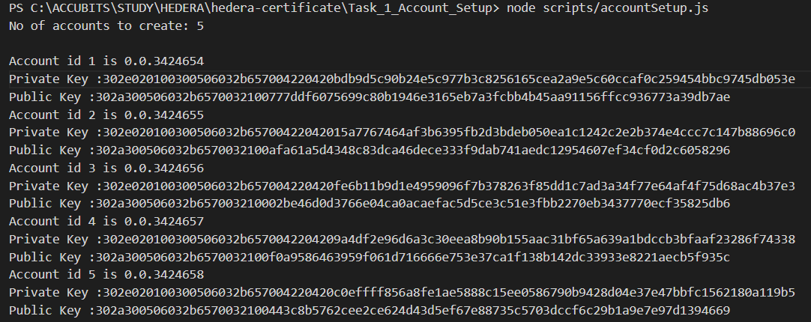

# Task 1

## Problem

Create a script to generate 5 Hedera Testnet accounts (Account1,
Account2, Account3, Account4 and Account5).
Use these accounts as indicated in the following tasks.
These accounts must not already exist before the start of the test.
Be sure to note down the account Id and keys of the accounts –
you will need these later. You will also need to communicate these
account IDs during your response to the certification test.
Fund the accounts as you see appropriate to cover the costs of
your tasks.

## Prerequisite

- using node v18.9.0 (npm v8.19.1)
- go to folder (Task_1_Account_Setup)
- `npm install`
- rename sample.env to .env and fillout the values

## How to run

run command `npm start`

## Output

