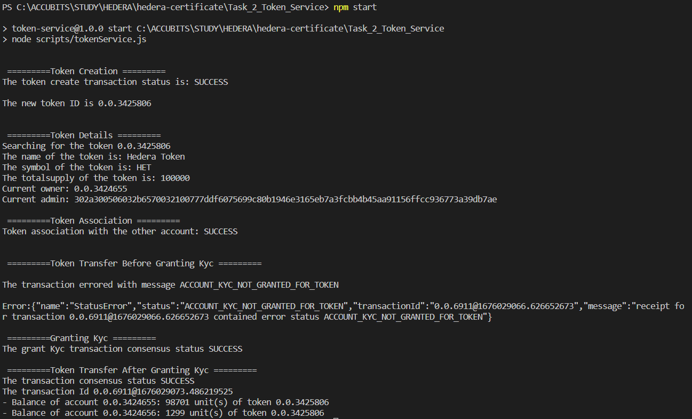

# Task 2

## Problem

Create a script that generates a fungible token that requires a KYC
process to be completed.
Set a fixed supply of 1000. Associate Account3, but do not KYC it.
Try to send 12.99 tokens from Account2 to Account3.
Show that the account is not yet able to participate in the token
because it is not been KYC approved.
Now set the KYC flag on Account3 and retry the transfer.

## Prerequisite

- using node v18.9.0 (npm v8.19.1)
- go to folder (Task_1_Token_Service)
- `npm install`
- rename sample.env to .env and fillout the values

## How to run

run command `npm start`

## Output

