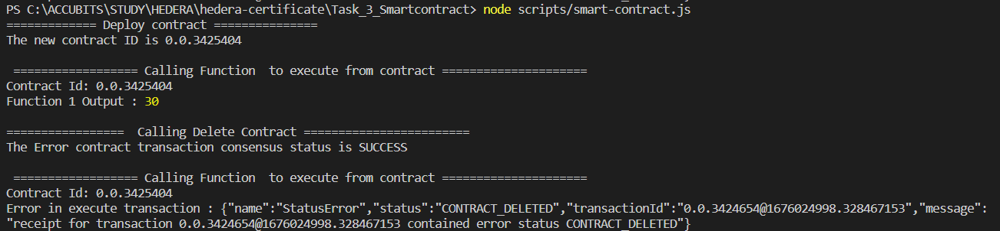

# Task 3

## Problem

Compile the Solidity contract given below using
Account1 and deploy it to the Hedera Network using
the HCS with the ContractCreateFlow method. Write a
script to call “function1” with the parameters 5 and 6.
Gather the result and display it in the output.
Delete the smart contract.

## Prerequisite

- using node v18.9.0 (npm v8.19.1)
- go to folder (Task_1_Account_Setup)
- `npm install`
- rename sample.env to .env and fillout the values

## How to run

run command `npm start`

## Output

