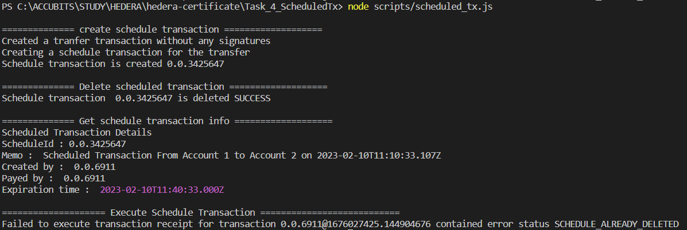

# Task 4

## Problem

Create a script that creates a scheduled transaction of 2 hbar from
Account1 to Account2.
Make a second script that deletes the transaction.
Print out the schedule information along the way along with the
proof that the transfer did not happen.
Try to execute the transaction and show that it does not work.

## Prerequisite

- using node v18.9.0 (npm v8.19.1)
- go to folder (Task_1_Account_Setup)
- `npm install`
- rename sample.env to .env and fillout the values

## How to run

run command `npm start`

## Output

