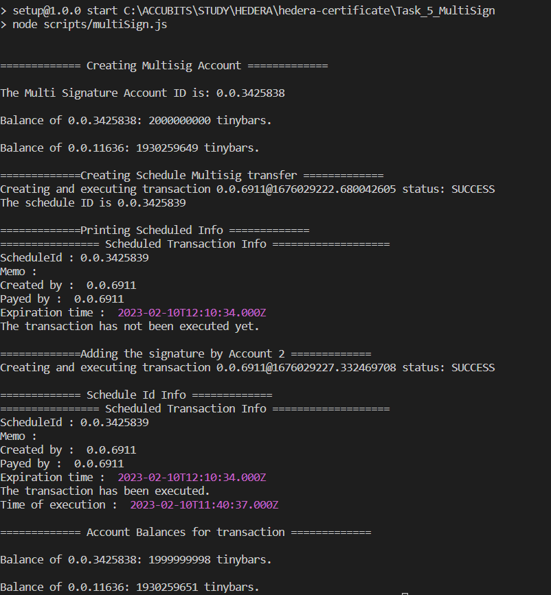

# Task 5

## Problem

Create a scheduled transaction with a key list with 3 key
(Account1, Account2 and Account3) that requires 2 of the three
keys.
Sign the transaction with Account1. Get the information of the
transaction and show that it has not yet been executed.
Sign the transaction with Account2 and get the information again
to show that it has been executed.

## Prerequisite

- using node v18.9.0 (npm v8.19.1)
- go to folder (Task_5_Consensus_service)
- `npm install`
- rename sample.env to .env and fillout the values

## How to run

run command `npm start`

## Output

