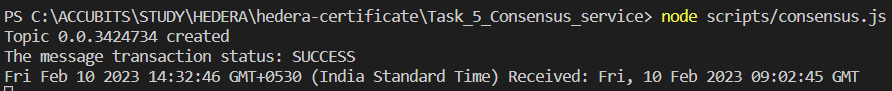

# Task 6

## Problem

Create a script to create a consensus transaction on the Hedera
Consensus Service using Account1. Write the current time in the
message of the transaction and submit.

## Prerequisite

- using node v18.9.0 (npm v8.19.1)
- go to folder (Task_5_Consensus_service)
- `npm install`
- rename sample.env to .env and fillout the values

## How to run

run command `npm start`

## Output

